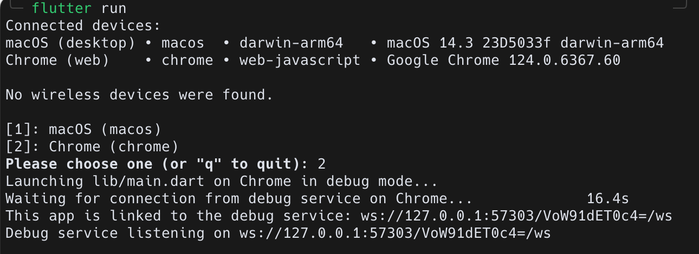
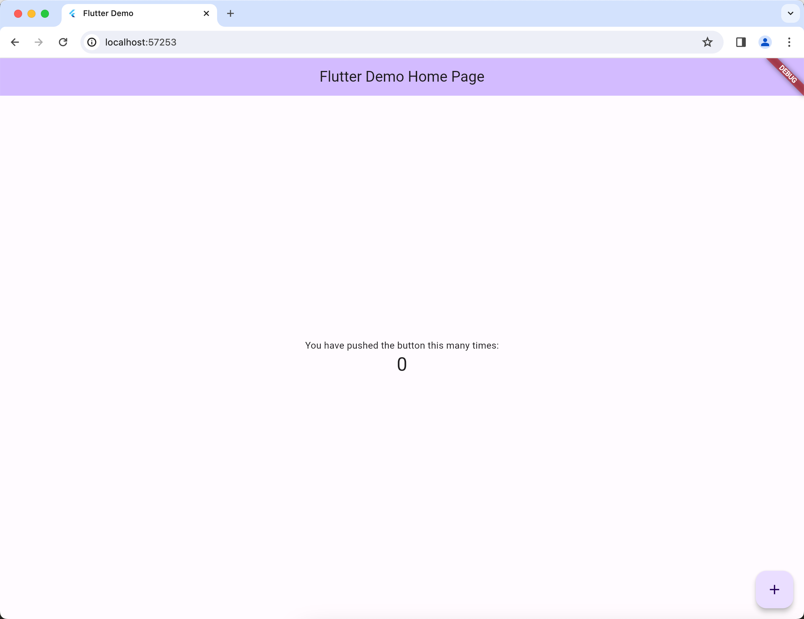

# Hello `Flutter`

Flutter, from zero to hero.(maybe)

## Goals

- `Hello World`
- widgets/components
- page/route navigation
- state management
- `todo` web app

---

## Preparation

Download then install [Flutter](https://flutter.dev/docs/get-started/install)

Extract the zip file into the directory `~/development/`

Create `~/.zshenv` file and add the following line:

```bash
export PATH=$HOME/development/flutter/bin:$PATH
```

Then run the following command, or restart all open terminal sessions to apply the changes.

```bash
source ~/.zshenv
```

Run the following command to check if Flutter is installed:

```bash
flutter doctor
```

Create project

```bash
flutter create hello_flutter
```

Run this project

```bash
cd hello_flutter
```

```bash
flutter run
```

Type `2`



Your browser should open and display the following:

